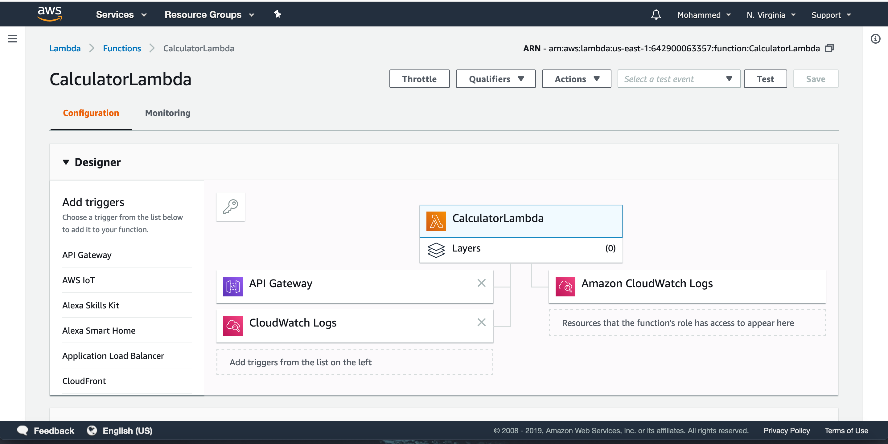
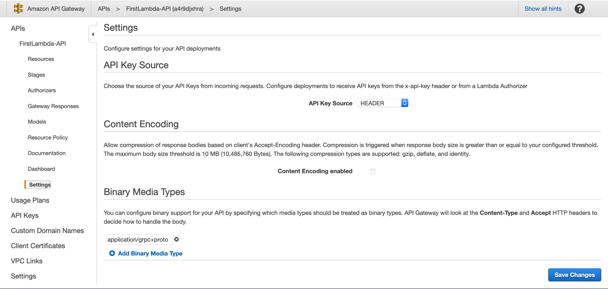
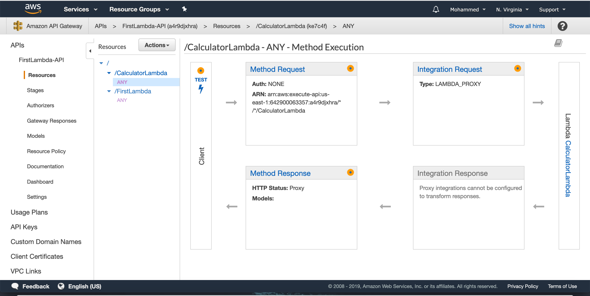
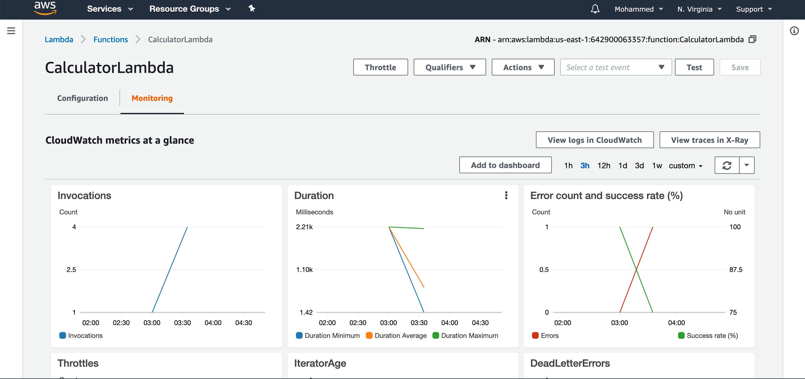
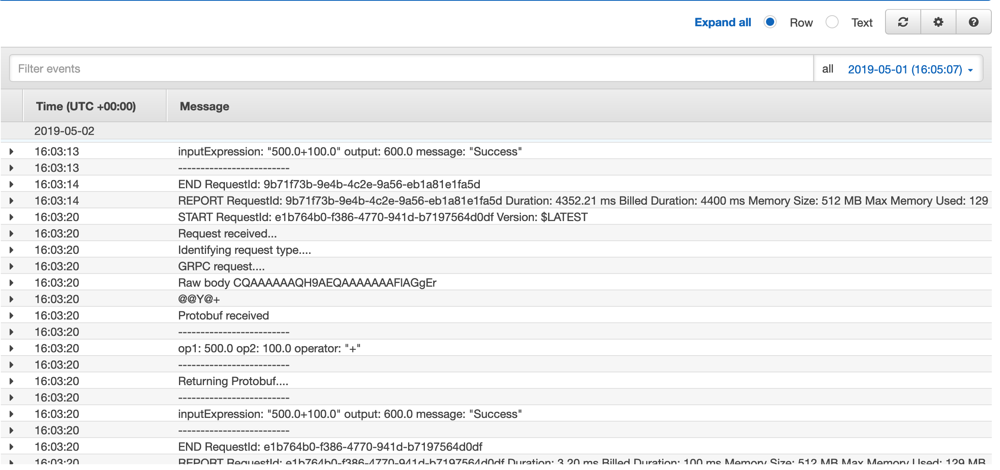

# Overview

AWS Lambda implementation with Scala and Grpc running a simple calculator functionality.
Also supports REST requests (communication with JSON over Http).

[Link to Lambda clients project](https://bitbucket.org/Iam_MohammedSiddiq/mohammed_siddiq_hw6_clients)

 
# Description

Uses ProtoBuffers for communication where the lambda receives request as a protobuff
binary and responds the request with a protobuff.


## Protcol Buffers

The following is the ProtoBuff declaration for the Input message:

```proto

message Input {

    double op1 = 1;

    double op2 = 2;

    string operator = 3;

}
```

Response Message:

```proto

message Response {
    string inputExpression = 1;
    double output = 2;
    string message = 3;
}
```

And the service:

```proto
service Calculator {
    rpc Calculate (Input) returns (Response);
}
```

## Requests and Response


##### GRPC REQUEST 

```scala
Http("API EndPoint").postData(protoBuffInputMessage.toByteArray)
    .header("Content-Type", "application/grpc+proto")
    .header("x-api-key", "yourApiKey").asString
```

Sample Request Proto received by the handler

```
Protobuf received
-------------------------
op1: 500.0
op2: 100.0
operator: "+"
```

##### GRPC Response

Sample Proto Response sent by the handler

```
Returning Protobuf
-------------------------
inputExpression: "500.0+100.0"
output: 600.0
message: "Success"
```

#

##### HTTP Request

```yaml
curl -X GET \
  'https://a4r9djxhra.execute-api.us-east-1.amazonaws.com/default/CalculatorLambda?op1=1292922&op2=339.33&operator=%2B' \
  -H 'Postman-Token: 28fc6f99-1138-4cac-a67a-4f5bd75469f4' \
  -H 'cache-control: no-cache' \
  -H 'x-api-key: QDqkEgvLZZ2rqt5RlZ6Gx2SpOm0FsFRE5yjsByQZanan'
```

##### JSON Response 

```json
{
    "inputExpression": "1292922.0 + 339.33",
    "output": 1293261.33,
    "message": "success"
}
```


# Steps to run

Build a fat jar using the following command : 

```sbtshell
Sbt clean assembly
```

This will run the tests and build a deployable jar.

Deploy the Jar on AWS Lambda. The following pictures give a snapshots.

### Lambda Function Deployed



##

### Lambda Media Type Setting For GRPC



##

### Lambda Function Stages



##

### CloudWatch Metrics



##

### CloudWatch Logs



##
